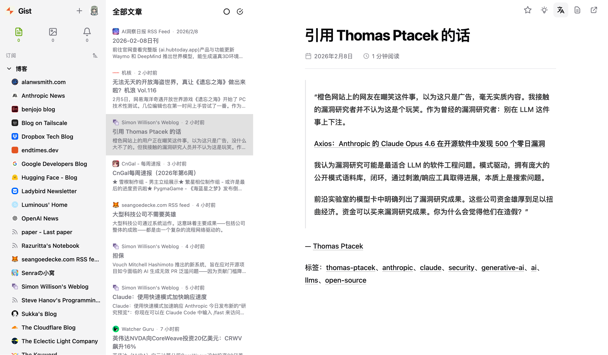

# Gist

[](https://www.gnu.org/licenses/old-licenses/gpl-2.0.en.html) [](https://deepwiki.com/9bingyin/Gist) [![zread](https://img.shields.io/badge/Ask_Zread-_.svg?style=flat&color=00b0aa&labelColor=000000&logo=data%3Aimage%2Fsvg%2Bxml%3Bbase64%2CPHN2ZyB3aWR0aD0iMTYiIGhlaWdodD0iMTYiIHZpZXdCb3g9IjAgMCAxNiAxNiIgZmlsbD0ibm9uZSIgeG1sbnM9Imh0dHA6Ly93d3cudzMub3JnLzIwMDAvc3ZnIj4KPHBhdGggZD0iTTQuOTYxNTYgMS42MDAxSDIuMjQxNTZDMS44ODgxIDEuNjAwMSAxLjYwMTU2IDEuODg2NjQgMS42MDE1NiAyLjI0MDFWNC45NjAxQzEuNjAxNTYgNS4zMTM1NiAxLjg4ODEgNS42MDAxIDIuMjQxNTYgNS42MDAxSDQuOTYxNTZDNS4zMTUwMiA1LjYwMDEgNS42MDE1NiA1LjMxMzU2IDUuNjAxNTYgNC45NjAxVjIuMjQwMUM1LjYwMTU2IDEuODg2NjQgNS4zMTUwMiAxLjYwMDEgNC45NjE1NiAxLjYwMDFaIiBmaWxsPSIjZmZmIi8%2BCjxwYXRoIGQ9Ik00Ljk2MTU2IDEwLjM5OTlIMi4yNDE1NkMxLjg4ODEgMTAuMzk5OSAxLjYwMTU2IDEwLjY4NjQgMS42MDE1NiAxMS4wMzk5VjEzLjc1OTlDMS42MDE1NiAxNC4xMTM0IDEuODg4MSAxNC4zOTk5IDIuMjQxNTYgMTQuMzk5OUg0Ljk2MTU2QzUuMzE1MDIgMTQuMzk5OSA1LjYwMTU2IDE0LjExMzQgNS42MDE1NiAxMy43NTk5VjExLjAzOTlDNS42MDE1NiAxMC42ODY0IDUuMzE1MDIgMTAuMzk5OSA0Ljk2MTU2IDEwLjM5OTlaIiBmaWxsPSIjZmZmIi8%2BCjxwYXRoIGQ9Ik0xMy43NTg0IDEuNjAwMUgxMS4wMzg0QzEwLjY4NSAxLjYwMDEgMTAuMzk4NCAxLjg4NjY0IDEwLjM5ODQgMi4yNDAxVjQuOTYwMUMxMC4zOTg0IDUuMzEzNTYgMTAuNjg1IDUuNjAwMSAxMS4wMzg0IDUuNjAwMUgxMy43NTg0QzE0LjExMTkgNS42MDAxIDE0LjM5ODQgNS4zMTM1NiAxNC4zOTg0IDQuOTYwMVYyLjI0MDFDMTQuMzk4NCAxLjg4NjY0IDE0LjExMTkgMS42MDAxIDEzLjc1ODQgMS42MDAxWiIgZmlsbD0iI2ZmZiIvPgo8cGF0aCBkPSJNNCAxMkwxMiA0TDQgMTJaIiBmaWxsPSIjZmZmIi8%2BCjxwYXRoIGQ9Ik00IDEyTDEyIDQiIHN0cm9rZT0iI2ZmZiIgc3Ryb2tlLXdpZHRoPSIxLjUiIHN0cm9rZS1saW5lY2FwPSJyb3VuZCIvPgo8L3N2Zz4K&logoColor=ffffff)](https://zread.ai/9bingyin/Gist)

[](https://github.com/9bingyin/Gist/releases/latest) [](https://github.com/9bingyin/Gist/actions/workflows/docker-build.yml)

轻量级自托管 RSS 阅读器，内置 AI 能力。



## 功能特性

- 全格式订阅，支持 RSS 2.0 / Atom / JSON Feed
- Readability 沉浸式阅读模式
- AI 摘要与翻译，支持 OpenAI / Anthropic / 兼容接口 (BYOK)
- 文件夹分层管理与内容分类
- 浅色 / 深色 / 跟随系统主题
- PWA，可安装到桌面和移动设备
- 多语言 (简体中文 / English)

## 部署

### Docker Compose (推荐)

```bash
curl -O https://raw.githubusercontent.com/9bingyin/Gist/main/docker-compose.yml
docker compose up -d
```

或手动创建 `docker-compose.yml`:

```yaml
services:
  gist:
    image: ghcr.io/9bingyin/gist:latest
    container_name: gist
    ports:
      - "8080:8080"
    volumes:
      - ./data:/app/data
    environment:
      - GIST_LOG_LEVEL=info
    restart: always
```

访问 `http://localhost:8080`，数据持久化在 `./data` 目录。

### Docker Run

```bash
docker run -d \
  --name gist \
  -p 8080:8080 \
  -v ./data:/app/data \
  ghcr.io/9bingyin/gist:latest
```

### 镜像标签

| 标签 | 说明 |
|------|------|
| `latest` | 最新稳定版 |
| `1.0.0` | 指定版本 |
| `1.0` | 该 minor 版本的最新 patch |
| `1` | 该 major 版本的最新 minor |
| `develop` | 每次推送 `main` 分支自动构建 |

所有镜像均为多架构 (`linux/amd64`, `linux/arm64`)。

### 环境变量

| 变量 | 默认值 | 说明 |
|------|--------|------|
| `GIST_ADDR` | `:8080` | 监听地址 |
| `GIST_DATA_DIR` | `/app/data` | 数据目录 |
| `GIST_STATIC_DIR` | `/app/static` | 静态文件目录 |
| `GIST_LOG_LEVEL` | `info` | 日志级别 (`debug` / `info` / `warn` / `error`) |

## 本地开发

### 前置依赖

- Go 1.25+
- [Bun](https://bun.sh/)

### 后端

```bash
cd backend
go mod download
go run ./cmd/server/main.go
```

### 前端

```bash
cd frontend
bun install
bun run dev
```

### 测试

```bash
# 后端
cd backend
make test    # 运行测试 (含 race 检测)
make lint    # 运行 golangci-lint

# 前端
cd frontend
bun run test
bun run lint
```

## 许可证

[GPL-2.0](./LICENSE)
