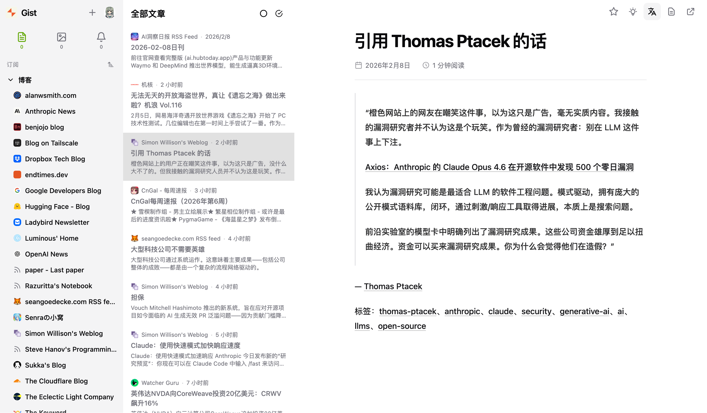

# Gist

[](https://www.gnu.org/licenses/old-licenses/gpl-2.0.en.html) [](https://deepwiki.com)

[](https://github.com/9bingyin/Gist/releases/latest) [](https://github.com/9bingyin/Gist/actions)

轻量级自托管 RSS 阅读器，内置 AI 能力。



移动端截图  


## 功能特性

- 全格式订阅，支持 RSS 2.0 / Atom / JSON Feed
- Readability 沉浸式阅读模式
- AI 摘要与翻译，支持 OpenAI / Anthropic / 兼容接口 (BYOK)
- 文件夹分层管理与内容分类
- 浅色 / 深色 / 跟随系统主题
- PWA，可安装到桌面和移动设备，滚动时可触发终端浏览器地址栏和工具栏隐藏，实现阅读界面最大化
- 多语言 (简体中文 / English)

## 部署

### Docker Compose (推荐)

```bash
curl -O https://raw.githubusercontent.com/9bingyin/Gist/main/docker-compose.yml
docker compose up -d
```

或手动创建 `docker-compose.yml`:

```yaml
services:
  gist:
    image: ghcr.io/9bingyin/gist:latest
    container_name: gist
    ports:
      - "8080:8080"
    volumes:
      - ./data:/app/data
    environment:
      - GIST_LOG_LEVEL=info
    restart: always
```

访问 `http://localhost:8080`，数据持久化在 `./data` 目录。

###  通过镜像包安装
参照重新部署说明：[link(https://github.com/valuex/Gist/blob/main/reinstall_using_tar.md)

### Docker Run

```bash
docker run -d \
  --name gist \
  -p 8080:8080 \
  -v ./data:/app/data \
  ghcr.io/9bingyin/gist:latest
```

### 镜像标签

| 标签 | 说明 |
|------|------|
| `latest` | 最新稳定版 |
| `1.2.0` | 指定版本 |
| `1.2` | 该 minor 版本的最新 patch |
| `1` | 该 major 版本的最新 minor |
| `develop` | 每次推送 `main` 分支自动构建 |

所有镜像均为多架构 (`linux/amd64`, `linux/arm64`)。

### 环境变量

| 变量 | 默认值 | 说明 |
|------|--------|------|
| `GIST_ADDR` | `:8080` | 监听地址 |
| `GIST_DATA_DIR` | `/app/data` | 数据目录 |
| `GIST_STATIC_DIR` | `/app/static` | 静态文件目录 |
| `GIST_LOG_LEVEL` | `info` | 日志级别 (`debug` / `info` / `warn` / `error`) |

## API 文档

本项目提供了完整的 RESTful API，支持订阅源的增、删、改、查操作。

### API 特性

- **订阅管理**: 创建、更新、删除订阅源
- **文章操作**: 获取文章列表、标记已读/收藏
- **分类管理**: 支持分层文件夹结构
- **认证**: Token 基础认证
- **速率限制**: 每分钟 60 个请求

### 快速开始

获取所有订阅源：
```bash
curl -H "Authorization: Bearer <token>" \
  http://localhost:8080/api/feeds
```

创建新订阅源：
```bash
curl -X POST http://localhost:8080/api/feeds \
  -H "Content-Type: application/json" \
  -H "Authorization: Bearer <token>" \
  -d '{
    "url": "https://example.com/feed",
    "title": "Example Feed",
    "category": "Technology"
  }'
```

详细的 API 文档请查看 [API.md](./API.md)。

## 本地开发

### 前置依赖

- Go 1.25+
- [Bun](https://bun.sh/)

### 后端

```bash
cd backend
go mod download
go run ./cmd/server/main.go
```

### 前端

```bash
cd frontend
bun install
bun run dev
```

### 测试

```bash
# 后端
cd backend
make test    # 运行测试 (含 race 检测)
make lint    # 运行 golangci-lint

# 前端
cd frontend
bun run test
bun run lint
```

## 许可证

[GPL-2.0](./LICENSE)

## 便捷操作特性
- 特定feed支持三种视图自定义：常规模式（显示rss feed提供的内容）；阅读模式（显示全文）；浏览器（将文章在新tab打开，适用于需要登录查看全文的文章）
- 文章列表右滑显示feed列表
- 自动触发隐藏终端浏览器的地址栏和工具栏，实现阅读界面最大化
- 滚动出顶部工具栏时自动将文章标记为已读
- 浮动按钮便于将整个目录或feed下文章标记为已读
- 记住feed文章列表和文章阅读位置，便于继续从上次位置开始阅读

